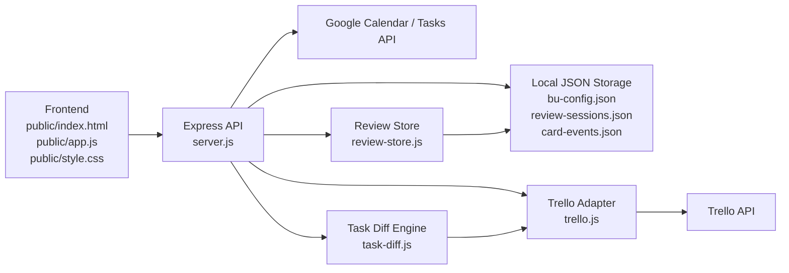
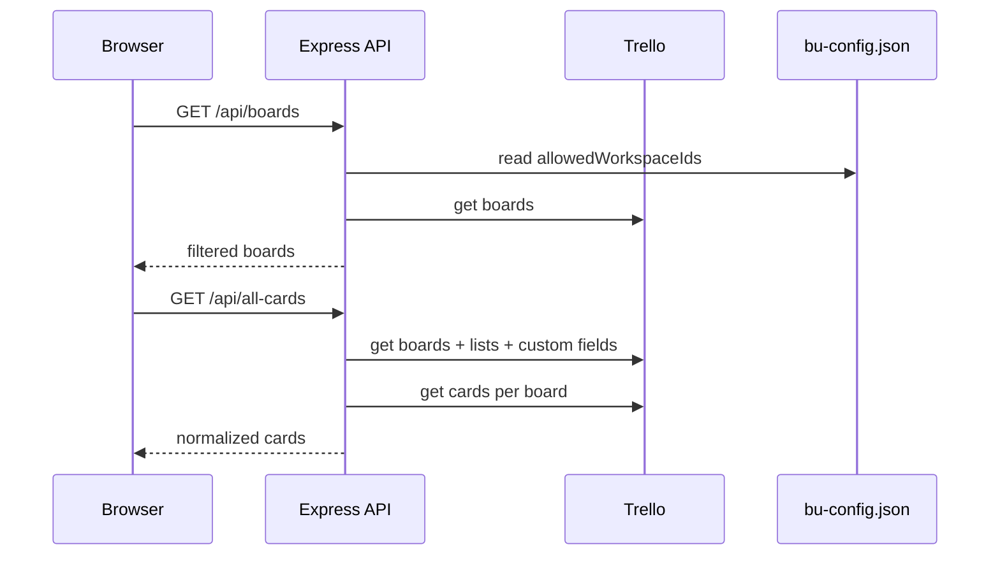
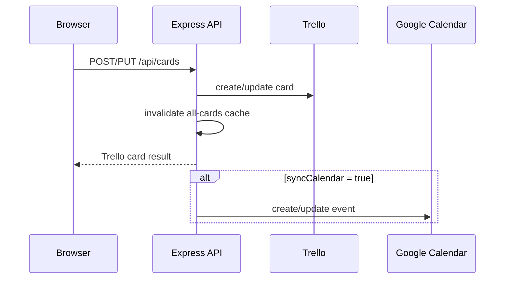
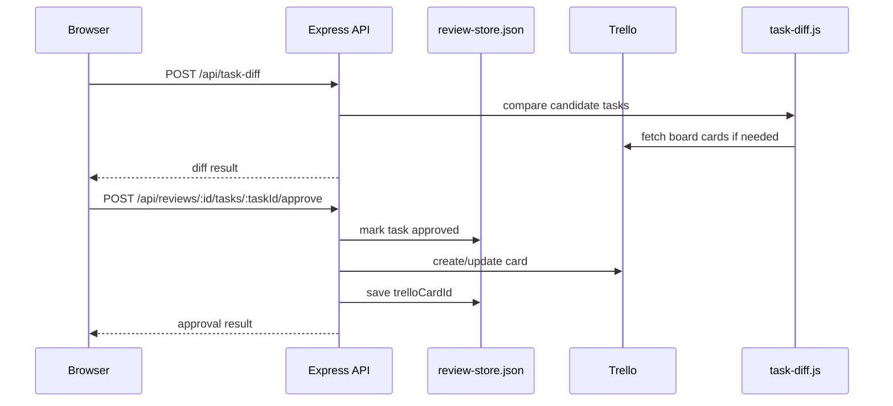

# Trisilar Task Hub - Software Architecture Analysis

**Doc Role:** Archived architecture analysis
**Status:** Archived V0.1 reference; active architecture lives in `../reference/ARCHITECTURE.md`
**Last Updated:** 2026-05-08 - **Moved by:** Codex PM
**Primary use:** Historical V0.1 refactor rationale and older architecture notes.

---

## Executive Summary

Trisilar Task Hub is currently a **local-first integration dashboard**. It is designed to help a small team operate Trello, Google Calendar, Google Tasks, Review Queue, OKR/Portfolio views, and weekly planning from one place.

The current architecture is a **working monolith**:

- Frontend is mostly one large vanilla JavaScript file.
- Backend is one Express server file with many responsibilities.
- Trello integration is partially separated into an adapter.
- Review Queue and task diff logic are separated into small modules.
- Local JSON files are used as lightweight persistence.

This is practical for internal MVP usage and a 2-person team. For Version 0.1, the main architectural goal should be **modularization without over-engineering**.

---

## High-Level Architecture



---

## Runtime Components

### 1. Frontend UI

**Main files**

- `public/index.html`
- `public/app.js`
- `public/style.css`

**Current responsibility**

The frontend handles:

- Navigation and sidebar state
- Today Dashboard
- Board view
- BU / group view
- All Tasks view
- Boards Monitor
- OKR / Portfolio view
- Weekly Focus view
- Calendar view
- Google Tasks planner
- Review Queue UI
- Card create/edit/delete modal
- Checklist UI
- Settings and workspace visibility

**Architecture concern**

`public/app.js` is currently about 3,500+ lines and acts as:

- Router
- State store
- API client
- UI renderer
- Event handler registry
- Page controller

This is acceptable for MVP, but it is the highest-risk file for Version 0.1 because feature work can easily create regressions.

---

### 2. Backend API

**Main file**

- `server.js`

**Current responsibility**

The backend handles:

- Express static server
- Trello board/list/card/checklist APIs
- Trello all-cards aggregation
- Trello custom field normalization
- In-memory cache
- BU config read/write
- Google OAuth setup
- Google Calendar CRUD
- Google Tasks CRUD
- Trello card to Google Calendar sync
- Review Queue API
- Task Diff API
- Friendly error mapping

**Architecture concern**

`server.js` is doing too many jobs. It should be split gradually into route modules and service modules.

---

### 3. Trello Adapter

**Main file**

- `trello.js`

**Current responsibility**

Wraps Trello REST API operations:

- Workspaces
- Boards
- Lists
- Cards
- Checklists
- Labels
- Members
- Custom fields
- Comments

**Good existing pattern**

This file is already a useful integration boundary. Future Trello-specific logic should continue to stay out of `server.js` when possible.

**Architecture concern**

Some update/create operations still encode large fields into query strings. For long descriptions or future richer content, prefer JSON body requests where Trello supports it.

---

### 4. Review Queue Store

**Main file**

- `review-store.js`

**Storage file**

- `review-sessions.json`

**Current responsibility**

Stores review sessions created from meeting notes or task extraction workflows.

Supports:

- Create session
- Read sessions
- Update task
- Approve task
- Reject task
- Link approved task to Trello card
- Dismiss completed session

**Architecture concern**

JSON file storage is okay for local MVP. For Version 0.1 and beyond, if review sessions become important data, this should move to SQLite.

---

### 5. Task Diff Engine

**Main file**

- `task-diff.js`

**Current responsibility**

Compares candidate task titles against existing Trello cards using Dice coefficient similarity on character bigrams.

Outputs:

- `create_new`
- `update_existing`
- `possible_duplicate`

**Good existing pattern**

This is a clean isolated domain module. It should remain separate.

**Future improvement**

For Version 0.1, consider enriching matching with:

- Board context
- List status
- Labels
- Due date proximity
- Description similarity
- AI-assisted semantic match as optional second pass

---

### 6. Local JSON Persistence

**Files**

- `bu-config.json`
- `review-sessions.json`
- `card-events.json`

**Current responsibility**

Stores local app state:

- BU groups
- Hidden boards
- Allowed workspace IDs
- Monitor teams
- Review sessions
- Trello card to Google Calendar event mappings

**Architecture concern**

JSON storage is simple but fragile for:

- Concurrent writes
- Corrupt files
- Backups
- Migrations
- Multi-user usage
- Querying/filtering historical data

For local Version 0.1, SQLite would be the best next storage layer.

---

## Data Flow

### Loading Dashboard Data



### Creating or Editing Trello Cards



### Review Queue Approval



---

## Current Strengths

1. **Fast local workflow**
   The app is easy to run locally and does not require complex infrastructure.

2. **Useful integrations**
   Trello, Google Calendar, Google Tasks, Review Queue, OKR, and Weekly Focus are already connected in one operational dashboard.

3. **Good adapter starting point**
   `trello.js` is a useful boundary between business logic and Trello API calls.

4. **Practical cache**
   Backend cache reduces Trello API calls when switching views quickly.

5. **Domain logic has started to separate**
   `task-diff.js` and `review-store.js` are good examples of logic that should stay outside the main server file.

6. **Normalized card shape**
   `normalizeCard()` in `server.js` gives the frontend a more consistent card structure.

---

## Main Architecture Risks

### Risk 1: Frontend Monolith

`public/app.js` is the largest risk.

Current symptoms:

- Many page renderers in one file
- Global state object `S`
- Many direct `innerHTML` render operations
- Many direct event listeners
- API calls mixed with rendering logic

Impact:

- Hard to test
- Hard to refactor safely
- Easy to create regressions
- Difficult for AI agents to edit without touching unrelated behavior

Recommended direction:

Split by page/module before adding more major UI features.

---

### Risk 2: Backend God File

`server.js` mixes many layers.

Current symptoms:

- Routes
- Service logic
- Google clients
- Trello orchestration
- Local file persistence
- Cache logic
- Error mapping
- Calendar sync mapping

Impact:

- Hard to understand responsibility boundaries
- Hard to test API behavior independently
- Hard to swap storage or integration logic later

Recommended direction:

Split into route modules and service modules.

---

### Risk 3: Local JSON Storage

JSON files are acceptable for MVP but weak for Version 0.1 if the app becomes a serious operating system.

Risks:

- Corrupt JSON can wipe data silently in some paths
- No schema migration
- No query layer
- No transaction safety
- Not suitable for multiple users/processes

Recommended direction:

Move app-owned state to SQLite.

Keep Trello as source of truth for Trello cards.

---

### Risk 4: Encoding / Mojibake

Some Thai text in comments/docs appears corrupted as mojibake, for example `à¸...`.

Impact:

- Harder for humans and AI agents to read intent
- Documentation loses value
- Comments become noisy

Recommended direction:

Gradually clean encoding in touched files. Avoid massive unrelated formatting churn.

---

### Risk 5: Limited Automated Tests

`package.json` currently has a placeholder `test` script.

Impact:

- Regression risk is high
- Refactors are harder
- AI agents have less safety feedback

Recommended direction:

Add smoke tests first, not full test coverage.

---

## Recommended Version 0.1 Architecture Target

Version 0.1 should not rewrite the app. It should turn the current working monolith into a **modular local-first app**.

### Target Backend Shape

```text
server.js
src/
  routes/
    trello.routes.js
    config.routes.js
    calendar.routes.js
    google-tasks.routes.js
    review.routes.js
    okr.routes.js
  services/
    trello.service.js
    calendar.service.js
    google-tasks.service.js
    review.service.js
    config.service.js
    cache.service.js
  integrations/
    trello.client.js
    google.client.js
  storage/
    json-store.js
    sqlite-store.js
  domain/
    normalize-card.js
    task-diff.js
    okr-progress.js
```

### Target Frontend Shape

```text
public/
  index.html
  style.css
  app.js
  js/
    api.js
    state.js
    router.js
    utils.js
    pages/
      today.js
      boards.js
      all-tasks.js
      calendar.js
      planner.js
      review.js
      okr.js
      weekly-focus.js
      settings.js
    components/
      card.js
      modal.js
      checklist.js
      labels.js
```

For Version 0.1, it is enough to split the largest and riskiest modules first.

---

## Recommended Refactor Roadmap

### Step 1: Add Basic Scripts

Add useful scripts to `package.json`:

```json
{
  "scripts": {
    "start": "node server.js",
    "dev": "node server.js",
    "smoke": "node scripts/smoke-test.js"
  }
}
```

Why:

- Claude Code and future agents need standard commands.
- Users should not need to remember `node server.js`.

---

### Step 2: Create API Smoke Tests

Add a minimal smoke test that checks:

- `GET /`
- `GET /api/config`
- `GET /api/boards`
- `GET /api/calendar/status`
- `GET /api/reviews`

Do not aim for full coverage first. The goal is to catch broken server startup and obvious route failures.

---

### Step 3: Split Backend Routes

First extraction targets from `server.js`:

1. `routes/config.routes.js`
2. `routes/calendar.routes.js`
3. `routes/google-tasks.routes.js`
4. `routes/review.routes.js`
5. `routes/trello.routes.js`

Keep behavior unchanged.

Acceptance criteria:

- All existing endpoints keep the same URL and response shape.
- `node server.js` still works.
- Smoke tests pass.

---

### Step 4: Split Backend Services

Move logic out of routes:

- Cache operations to `services/cache.service.js`
- Config file read/write to `services/config.service.js`
- Google Calendar logic to `services/calendar.service.js`
- Google Tasks logic to `services/google-tasks.service.js`
- Card normalization to `domain/normalize-card.js`

Acceptance criteria:

- Routes become thin.
- Services can be tested independently later.
- No user-facing behavior changes.

---

### Step 5: Split Frontend API / State / Router

First frontend extraction targets:

- `public/js/api.js`
- `public/js/state.js`
- `public/js/router.js`
- `public/js/utils.js`

Keep page renderers in `app.js` temporarily.

Acceptance criteria:

- Navigation still works.
- All pages still load.
- Card create/edit/delete still works.

---

### Step 6: Split Frontend Pages

Extract one page at a time:

1. `pages/today.js`
2. `pages/all-tasks.js`
3. `pages/boards.js`
4. `pages/review.js`
5. `pages/calendar.js`
6. `pages/okr.js`
7. `pages/settings.js`

Do not split all pages in one PR/session.

Acceptance criteria:

- Each extraction keeps behavior unchanged.
- Manual browser check after each page extraction.

---

### Step 7: Move Local State to SQLite

Move these files into SQLite tables:

- `bu-config.json`
- `review-sessions.json`
- `card-events.json`

Possible tables:

```text
app_config
review_sessions
review_tasks
card_calendar_events
```

Keep migration simple:

- On startup, if SQLite DB does not exist, import JSON files.
- Keep JSON backup files.

---

## Suggested AI Agent Work Prompts

### Prompt 1: Backend Route Split

```text
Read ARCHITECTURE_ANALYSIS.md first.

Task: Start Version 0.1 backend modularization.

Extract only config-related endpoints from server.js into src/routes/config.routes.js and src/services/config.service.js.

Keep endpoint URLs and response shapes unchanged:
- GET /api/config
- POST /api/config

Do not refactor unrelated endpoints.
Add or update a smoke test if a test harness exists.
After changes, run node server.js and verify GET /api/config returns the same shape as before.
```

### Prompt 2: Frontend API Module Split

```text
Read ARCHITECTURE_ANALYSIS.md first.

Task: Extract the frontend API helper from public/app.js into public/js/api.js.

Keep behavior unchanged.
Do not move page renderers yet.
Update public/index.html if needed.
Verify these actions still work:
- load Today page
- load All Tasks
- open Settings
- create/edit card API calls still use the same request shape
```

### Prompt 3: Smoke Test Setup

```text
Read ARCHITECTURE_ANALYSIS.md first.

Task: Add a simple smoke test for Trisilar Task Hub.

Add scripts/smoke-test.js that starts or assumes the server is running and checks:
- GET /
- GET /api/config
- GET /api/calendar/status
- GET /api/reviews

Update package.json scripts:
- start
- dev
- smoke

Keep dependencies minimal.
```

### Prompt 4: SQLite Migration Planning

```text
Read ARCHITECTURE_ANALYSIS.md first.

Task: Plan, but do not implement yet, a migration from local JSON files to SQLite.

Cover:
- tables
- fields
- startup migration behavior
- rollback/backups
- which APIs must stay unchanged
- risk areas

Write the plan to docs/SQLITE_MIGRATION_PLAN.md.
```

---

## Version 0.1 Priorities

### P0 - Must Do

- Add `start`, `dev`, and `smoke` scripts.
- Add basic API smoke test.
- Split `server.js` routes gradually.
- Split frontend `api`, `state`, `router`, and `utils`.

### P1 - Should Do

- Extract major frontend pages one by one.
- Clean mojibake in touched files.
- Add a small logging convention.
- Add a config validation layer.

### P2 - Later

- SQLite migration.
- TypeScript migration.
- Full automated UI tests.
- Multi-user auth.
- Production deployment hardening.

---

## Architectural Decision Notes

### Keep Local-First for Now

This app is valuable because it is fast and directly connected to the team's operating workflow. Do not prematurely convert it into a complex SaaS architecture.

Version 0.1 should preserve:

- Local startup
- Simple environment variables
- Trello as source of truth for cards
- Minimal infrastructure

### Use Trello as Source of Truth

Do not duplicate Trello card data into a database unless there is a specific reason.

The app should store:

- App configuration
- Review sessions
- Local mappings
- User preferences
- Portfolio/OKR metadata if not available in Trello labels/custom fields

But Trello should remain the source for:

- Boards
- Lists
- Cards
- Labels
- Checklists
- Due dates

### Refactor by Boundary, Not by Preference

Good extraction boundaries:

- API client
- Router
- Page renderer
- Service
- Integration client
- Storage adapter
- Domain logic

Avoid:

- Huge rewrite
- Framework migration before modularization
- Moving code only to make files smaller without clearer responsibility

---

## Final Recommendation

The current architecture is good enough for MVP and internal use. The next version should focus on making the system easier for humans and AI agents to modify safely.

The best Version 0.1 theme is:

> Keep the app local-first and useful, but split the monolith into clear modules so future features can be added without breaking existing workflows.
