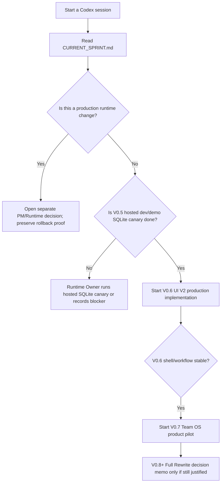

# Codex Parallel Project Handoff

**Doc Role:** Codex Desktop project setup guide for parallel Trisilar Task Hub worktrees
**Status:** Active handoff
**Owner:** PM
**Created:** 2026-05-15
**Updated by:** Codex PM
**Related Docs:** `CURRENT_SPRINT.md`, `PROJECT_LADDER.md`, `VERSION_0_5_FOUNDATION_HARDENING_PLAN.md`, `../reference/CODEX_PARALLEL_DEVELOPMENT_MODEL.md`

---

## Core Rule

Use one Codex Desktop project per folder/worktree.

```text
1 Codex project = 1 PC folder = 1 git worktree = 1 branch = 1 owner/scope
```

Do not point two Codex projects at the same folder. Do not switch branches inside a folder that another Codex project owns.

---

## Open These Codex Projects

| Codex Project Name | Folder To Link | Branch | Current Role | Status |
|---|---|---|---|---|
| `TaskHub PM Roadmap` | `C:\Users\User\Desktop\Shortcut\Programmer\Trisilar\trisilar-task-hub-v05-roadmap-rebaseline` | `codex/v05-roadmap-rebaseline` | PM / Integration docs | Closed through PR #28; do not continue here unless PM reopens roadmap docs |
| `TaskHub V0.4 Runtime` | `C:\Users\User\Desktop\Shortcut\Programmer\Trisilar\trisilar-task-hub-v04-paperclip-prod-integration` | Runtime live / docs closeout branch only if needed | Runtime Owner / QA | Complete; production permanent enablement active with rollback proof |
| `TaskHub V0.5 Foundation` | `C:\Users\User\Desktop\Shortcut\Programmer\Trisilar\trisilar-task-hub-v05-foundation` | Sync from latest `origin/dev` with PR #30 and PR #36 | Runtime Owner / QA | Next active runtime task: hosted dev/demo SQLite canary |
| `TaskHub UI V2 Design` | `C:\Users\User\Desktop\Shortcut\Programmer\Trisilar\trisilar-task-hub-uiv2-design-system` | `codex/uiv2-design-system` | UX Owner / Frontend design | Design-system work only until V0.6 implementation approval |
| `TaskHub Team OS Pilot` | `C:\Users\User\Desktop\Shortcut\Programmer\Trisilar\trisilar-task-hub-v07-team-os-pilot` | `codex/v07-team-os-pilot-docs` | PM / Operations | Docs-only pilot assumptions; no product features yet |

Do not use `trisilar-task-hub-v05-ui-v2-full-rewrite` as the active UI project unless PM explicitly reopens it. Its name implies a rewrite, and Full Rewrite is deferred to V0.8+ decision memo only.

---

## What To Run Next



---

## Starting Prompts

### `TaskHub PM Roadmap`

```text
Role: PM / Integration Owner
Task: No active task; roadmap rebaseline is closed unless PM explicitly reopens it.

Status:
- Closed through PR #28 at `dev@aaf8f58`.
- Do not continue this branch unless PM explicitly reopens roadmap docs.

Workspace:
C:\Users\User\Desktop\Shortcut\Programmer\Trisilar\trisilar-task-hub-v05-roadmap-rebaseline

Read first:
- docs/plans/CODEX_WORKTREE_PLAN.md
- CURRENT_SPRINT.md
- TODO.md
- docs/plans/PROJECT_LADDER.md
- docs/plans/VERSION_0_5_FOUNDATION_HARDENING_PLAN.md
- docs/adr/ADR_0003_FOUNDATION_BEFORE_UI_TEAM_OS.md
- docs/adr/ADR_0004_V05_PERSISTENCE_TESTS_AND_CONTRACTS.md
- docs/plans/CODEX_PARALLEL_PROJECT_HANDOFF.md

Goal:
Review the docs-only V0.5 roadmap rebaseline, run docs verification, then prepare a concise handoff for PR/merge.

Rules:
- Docs-only unless PM expands scope.
- Do not touch runtime secrets, Cloudflare, live flags, or product code.
- Do not modify the dirty main-worktree UI V2 artifacts.
- Preserve V0.4 as Runtime/QA-owned and V0.5 as foundation hardening.

Verification:
- git status --short --branch
- git diff --check
- rg -n "V0\\.5 Team Operating System|Full Rewrite[[:space:]]implementation" CURRENT_SPRINT.md TODO.md docs

Expected output:
- Findings if any.
- Files changed.
- Whether the branch is ready to stage/commit/PR.
```

### `TaskHub V0.4 Runtime`

```text
Role: Runtime Owner / QA / Paperclip Owner
Task: No active delivery task. V0.4 production monitoring, permanent enablement, and rollback proof passed.

Workspace:
C:\Users\User\Desktop\Shortcut\Programmer\Trisilar\trisilar-task-hub-v04-paperclip-prod-integration

Read first:
- docs/plans/CODEX_WORKTREE_PLAN.md
- CURRENT_SPRINT.md
- docs/plans/VERSION_0_4_LIVE_AI_OPERATIONS_PAPERCLIP_PRODUCTION_PLAN.md
- docs/deployment/ENVIRONMENT_MATRIX.md
- docs/deployment/RUNTIME_OPERATIONS_RUNBOOK.md
- docs/reference/SECURITY_ACCESS_POLICY.md

Goal:
Only reopen this lane if PM explicitly chooses a new production runtime change or rollback exercise.

Rules:
- Do not print, commit, or document secret values.
- Do not reuse dev/demo APP_DATA_DIR or secrets.
- Do not change production PAPERCLIP_WEBHOOK_ENABLED or PAPERCLIP_LIVE_MODE unless PM records a new runtime decision.
- Do not create Trello cards, Calendar events, or Google Tasks.
- Do not change non-runtime roadmap or UI docs from this project.

Verification:
- Confirm branch/folder with git status --short --branch.
- Use read-only checks first.
- If a runtime change is approved later, follow the V0.4 runbook and record rollback evidence without secret values.

Expected output:
- PM runtime change or no-change decision.
- Runtime evidence and rollback proof if flags change.
```

### `TaskHub V0.5 Foundation`

```text
Role: Runtime Owner / QA
Task: Execute hosted dev/demo SQLite canary from the latest accepted `dev` commit containing PR #30 foundation code and PR #36 runtime checklist, or record the host-access blocker.

Workspace:
C:\Users\User\Desktop\Shortcut\Programmer\Trisilar\trisilar-task-hub-v05-foundation

Read first:
- CURRENT_SPRINT.md
- docs/plans/VERSION_0_5_FOUNDATION_HARDENING_PLAN.md
- docs/adr/ADR_0003_FOUNDATION_BEFORE_UI_TEAM_OS.md
- docs/adr/ADR_0004_V05_PERSISTENCE_TESTS_AND_CONTRACTS.md
- docs/testing/TEST_STRATEGY.md
- docs/reference/ARCHITECTURE.md
- docs/reference/DATA_BACKUP_RETENTION_POLICY.md
- docs/deployment/ENVIRONMENT_MATRIX.md
- docs/deployment/V05_SQLITE_CANARY_RUNTIME_CHECKLIST.md

Goal:
Run the SQLite backend only on hosted dev/demo, prove health and rollback, and keep production JSON default.

Setup:
- npm.cmd ci
- npm test

Rules:
- Do not touch production runtime, Cloudflare policy, secrets, live Paperclip flags, or webhook auth behavior.
- Do not implement UI V2 production code.
- Do not implement Team OS product features.
- Do not create Trello, Calendar, Google Tasks, or live Paperclip side effects.
- If SSH or deploy access is missing, record a blocker instead of changing runtime state.

Verification target:
- Optional temp-data preflight: `npm.cmd run verify:persistence-canary-cycle`
- Hosted dev/demo `npm.cmd run migrate:sqlite`
- Hosted dev/demo `TASKHUB_STATE_BACKEND=sqlite`
- `npm.cmd run verify:sqlite-canary` from a shell with the same `APP_DATA_DIR`, `$env:TASKHUB_STATE_BACKEND = "sqlite"`, and `$env:SQLITE_CANARY_BASE_URL = "http://127.0.0.1:3000"`
- `npm.cmd run migrate:sqlite:export` rollback proof
- `npm.cmd run verify:json-rollback` after removing `TASKHUB_STATE_BACKEND`, restarting dev/demo, and setting `$env:JSON_ROLLBACK_BASE_URL = "http://127.0.0.1:3000"`

Expected output:
- Hosted canary pass/fail evidence or host-access blocker report.
- Whether dev/demo keeps SQLite enabled or rolls back to JSON, with `verify:json-rollback` evidence when rollback is chosen.
- Clear next V0.5 handoff: keep SQLite canary, rollback, or defer production decision.
```

### `TaskHub UI V2 Design`

```text
Role: UX Owner / Frontend Design
Task: Continue UI V2 design-system work as design-only handoff, not product implementation.

Workspace:
C:\Users\User\Desktop\Shortcut\Programmer\Trisilar\trisilar-task-hub-uiv2-design-system

Read first:
- docs/plans/CODEX_WORKTREE_PLAN.md
- CURRENT_SPRINT.md
- docs/plans/UI_WEB_DESIGN_V2_RESEARCH_AND_CLAUDE_DESIGN_HANDOFF_PLAN.md
- docs/design/ui-design-v2/CLAUDE_DESIGN_UI_V2_GUIDELINES.md
- docs/logs/V0_3_RUX_FINDINGS.md

Goal:
Produce or refine design-only UI V2 artifacts: concept screens, tokens, component inventory, responsive notes, and implementation handoff notes.

Setup if browser/prototype checks are needed:
- npm.cmd ci

Rules:
- Design-only until V0.6.
- Do not modify production app code under public/ or src/ unless PM explicitly changes scope.
- Do not start Full Rewrite.
- Do not touch runtime, Cloudflare, secrets, Paperclip live behavior, or V0.5 foundation files.
- Preserve Trello as execution surface, Task Hub as command/review layer, Review Queue as human gate.

Expected output:
- Design artifact summary.
- Route/component coverage.
- Gaps that V0.6 implementation must handle after V0.5 acceptance.
```

### `TaskHub Team OS Pilot`

```text
Role: PM / Operations
Task: Draft Team Operating System pilot assumptions as docs-only work.

Workspace:
C:\Users\User\Desktop\Shortcut\Programmer\Trisilar\trisilar-task-hub-v07-team-os-pilot

Read first:
- docs/plans/CODEX_WORKTREE_PLAN.md
- CURRENT_SPRINT.md
- TODO.md
- docs/plans/PROJECT_LADDER.md
- docs/reference/ORGANIZATION_OPERATING_MODEL.md
- docs/reference/AI_AGENT_GOVERNANCE.md
- docs/operations/TEAM_ONBOARDING_GUIDE.md

Goal:
Prepare docs-only pilot assumptions for V0.7 Team OS: onboarding, weekly rhythm, reporting needs, pilot checklist, and feedback loop.

Rules:
- Docs-only; no product feature implementation.
- Do not touch UI V2 production code.
- Do not touch V0.5 persistence/tests/contracts.
- Do not touch V0.4 runtime/secrets/live flags.
- Team OS product implementation waits for V0.6 shell/workflow stability.

Verification:
- git diff --check

Expected output:
- Pilot brief or blocker report.
- Clear dependency list on V0.5 and V0.6.
```

---

## Dependency State

| Project | Can Start Now? | Needs Before Product Implementation |
|---|---|---|
| PM Roadmap | No active task | Reopen only by PM request |
| V0.4 Runtime | Yes | Runtime secrets/service-token handled out of band |
| V0.5 Foundation | Yes for hosted canary handoff | Runtime Owner host access before changing hosted dev/demo |
| UI V2 Design | Yes, design-only | V0.5 acceptance before production implementation |
| Team OS Pilot | Yes, docs-only | V0.6 shell/workflow stability before product implementation |
| Full Rewrite | No | V0.8+ decision memo after V0.5/V0.6 evidence |

---

## Change Attribution

| Date | Change | Updated by |
|---|---|---|
| 2026-05-15 | Created Codex parallel project handoff with folder mapping and first prompts | Codex PM |
