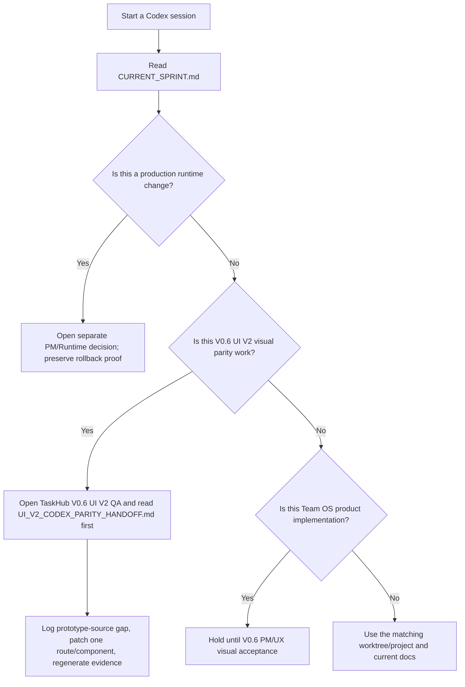

# Codex Parallel Project Handoff

**Doc Role:** Codex Desktop project setup guide for parallel Trisilar Task Hub worktrees
**Status:** Active handoff
**Owner:** PM
**Created:** 2026-05-15
**Updated by:** Codex PM
**Related Docs:** `CURRENT_SPRINT.md`, `PROJECT_LADDER.md`, `VERSION_0_5_FOUNDATION_HARDENING_PLAN.md`, `VERSION_0_6_UI_V2_PLANNING_SCOPE.md`, `../design/ui-design-v2/UI_V2_CODEX_PARITY_HANDOFF.md`, `../reference/CODEX_PARALLEL_DEVELOPMENT_MODEL.md`

---

## Core Rule

Use one Codex Desktop project per folder/worktree.

```text
1 Codex project = 1 PC folder = 1 git worktree = 1 branch = 1 owner/scope
```

Do not point two Codex projects at the same folder. Do not switch branches inside a folder that another Codex project owns.

---

## Open These Codex Projects

| Codex Project Name | Folder To Link | Branch | Current Role | Status |
|---|---|---|---|---|
| `TaskHub PM Roadmap` | `C:\Users\User\Desktop\Shortcut\Programmer\Trisilar\trisilar-task-hub-v05-roadmap-rebaseline` | `codex/v05-roadmap-rebaseline` | PM / Integration docs | Closed through PR #28; do not continue here unless PM reopens roadmap docs |
| `TaskHub V0.4 Runtime` | `C:\Users\User\Desktop\Shortcut\Programmer\Trisilar\trisilar-task-hub-v04-paperclip-prod-integration` | Runtime live / docs closeout branch only if needed | Runtime Owner / QA | Complete; production permanent enablement active with rollback proof |
| `TaskHub V0.5 Foundation` | `C:\Users\User\Desktop\Shortcut\Programmer\Trisilar\trisilar-task-hub-v05-foundation` | Sync from latest `origin/dev` with PR #30 and PR #36 | Runtime Owner / QA | Complete / PM accepted; no active runtime task unless PM reopens hosted or production storage decision |
| `TaskHub UI V2 Design` | `C:\Users\User\Desktop\Shortcut\Programmer\Trisilar\trisilar-task-hub-uiv2-design-system` | `codex/uiv2-design-system` | UX Owner / Frontend design | Planning artifacts accepted; V0.6 implementation/parity fixes live in `TaskHub V0.6 UI V2 QA` |
| `TaskHub V0.6 UI V2 QA` | `C:\Users\User\Desktop\Shortcut\Programmer\Trisilar\trisilar-task-hub-v06-uiv2-qa` | `codex/v06-uiv2-full-fidelity` | Frontend Dev / UX Owner / QA | Source-led full-fidelity recovery; PM/UX visual review next |
| `TaskHub Team OS Pilot` | `C:\Users\User\Desktop\Shortcut\Programmer\Trisilar\trisilar-task-hub-v07-team-os-pilot` | `codex/v07-team-os-pilot-docs` | PM / Operations | Docs-only pilot assumptions; no product features yet |

Do not use `trisilar-task-hub-v05-ui-v2-full-rewrite` as the active UI project unless PM explicitly reopens it. Its name implies a rewrite, and Full Rewrite is deferred to V0.8+ decision memo only.

---

## What To Run Next



---

## Starting Prompts

### `TaskHub PM Roadmap`

```text
Role: PM / Integration Owner
Task: No active task; roadmap rebaseline is closed unless PM explicitly reopens it.

Status:
- Closed through PR #28 at `dev@aaf8f58`.
- Do not continue this branch unless PM explicitly reopens roadmap docs.

Workspace:
C:\Users\User\Desktop\Shortcut\Programmer\Trisilar\trisilar-task-hub-v05-roadmap-rebaseline

Read first:
- docs/plans/CODEX_WORKTREE_PLAN.md
- CURRENT_SPRINT.md
- TODO.md
- docs/plans/PROJECT_LADDER.md
- docs/plans/VERSION_0_5_FOUNDATION_HARDENING_PLAN.md
- docs/adr/ADR_0003_FOUNDATION_BEFORE_UI_TEAM_OS.md
- docs/adr/ADR_0004_V05_PERSISTENCE_TESTS_AND_CONTRACTS.md
- docs/plans/CODEX_PARALLEL_PROJECT_HANDOFF.md

Goal:
Review the docs-only V0.5 roadmap rebaseline, run docs verification, then prepare a concise handoff for PR/merge.

Rules:
- Docs-only unless PM expands scope.
- Do not touch runtime secrets, Cloudflare, live flags, or product code.
- Do not modify the dirty main-worktree UI V2 artifacts.
- Preserve V0.4 as Runtime/QA-owned and V0.5 as foundation hardening.

Verification:
- git status --short --branch
- git diff --check
- rg -n "V0\\.5 Team Operating System|Full Rewrite[[:space:]]implementation" CURRENT_SPRINT.md TODO.md docs

Expected output:
- Findings if any.
- Files changed.
- Whether the branch is ready to stage/commit/PR.
```

### `TaskHub V0.4 Runtime`

```text
Role: Runtime Owner / QA / Paperclip Owner
Task: No active delivery task. V0.4 production monitoring, permanent enablement, and rollback proof passed.

Workspace:
C:\Users\User\Desktop\Shortcut\Programmer\Trisilar\trisilar-task-hub-v04-paperclip-prod-integration

Read first:
- docs/plans/CODEX_WORKTREE_PLAN.md
- CURRENT_SPRINT.md
- docs/plans/VERSION_0_4_LIVE_AI_OPERATIONS_PAPERCLIP_PRODUCTION_PLAN.md
- docs/deployment/ENVIRONMENT_MATRIX.md
- docs/deployment/RUNTIME_OPERATIONS_RUNBOOK.md
- docs/reference/SECURITY_ACCESS_POLICY.md

Goal:
Only reopen this lane if PM explicitly chooses a new production runtime change or rollback exercise.

Rules:
- Do not print, commit, or document secret values.
- Do not reuse dev/demo APP_DATA_DIR or secrets.
- Do not change production PAPERCLIP_WEBHOOK_ENABLED or PAPERCLIP_LIVE_MODE unless PM records a new runtime decision.
- Do not create Trello cards, Calendar events, or Google Tasks.
- Do not change non-runtime roadmap or UI docs from this project.

Verification:
- Confirm branch/folder with git status --short --branch.
- Use read-only checks first.
- If a runtime change is approved later, follow the V0.4 runbook and record rollback evidence without secret values.

Expected output:
- PM runtime change or no-change decision.
- Runtime evidence and rollback proof if flags change.
```

### `TaskHub V0.5 Foundation`

```text
Role: Runtime Owner / QA
Task: No active delivery task. V0.5 foundation is PM accepted after hosted dev/demo SQLite canary, rollback proof, and short monitor passed.

Workspace:
C:\Users\User\Desktop\Shortcut\Programmer\Trisilar\trisilar-task-hub-v05-foundation

Read first:
- CURRENT_SPRINT.md
- docs/plans/VERSION_0_5_FOUNDATION_HARDENING_PLAN.md
- docs/adr/ADR_0003_FOUNDATION_BEFORE_UI_TEAM_OS.md
- docs/adr/ADR_0004_V05_PERSISTENCE_TESTS_AND_CONTRACTS.md
- docs/testing/TEST_STRATEGY.md
- docs/reference/ARCHITECTURE.md
- docs/reference/DATA_BACKUP_RETENTION_POLICY.md
- docs/deployment/ENVIRONMENT_MATRIX.md
- docs/deployment/V05_SQLITE_CANARY_RUNTIME_CHECKLIST.md

Goal:
Only reopen this lane if PM explicitly asks for a hosted dev/demo follow-up, production storage decision, or runtime rollback exercise.

Rules:
- Do not touch production runtime, Cloudflare policy, secrets, live Paperclip flags, or webhook auth behavior.
- Do not implement UI V2 production code.
- Do not implement Team OS product features.
- Do not create Trello, Calendar, Google Tasks, or live Paperclip side effects.
- Hosted dev/demo may remain a SQLite canary, but production storage remains a separate Runtime Owner decision.
- If SSH or deploy access is missing during a reopened runtime task, record a blocker instead of changing runtime state.

Verification target:
- Confirm branch/folder with `git status --short --branch`.
- Use read-only checks first.
- If PM reopens hosted/prod storage work, follow `docs/deployment/V05_SQLITE_CANARY_RUNTIME_CHECKLIST.md` and record evidence without secret values.

Expected output:
- PM runtime follow-up decision or no-change report.
- Runtime evidence and rollback proof only if PM reopens this lane.
```

### `TaskHub UI V2 Design`

```text
Role: UX Owner / Frontend Design
Task: No active delivery task unless PM explicitly reopens UI V2 design artifacts.

Workspace:
C:\Users\User\Desktop\Shortcut\Programmer\Trisilar\trisilar-task-hub-uiv2-design-system

Read first:
- docs/plans/CODEX_WORKTREE_PLAN.md
- CURRENT_SPRINT.md
- docs/plans/UI_WEB_DESIGN_V2_RESEARCH_AND_CLAUDE_DESIGN_HANDOFF_PLAN.md
- docs/design/ui-design-v2/CLAUDE_DESIGN_UI_V2_GUIDELINES.md
- docs/logs/V0_3_RUX_FINDINGS.md

Goal:
Use this lane only for design-source clarification. V0.6 implementation/parity fixes must happen in `TaskHub V0.6 UI V2 QA`.

Setup if browser/prototype checks are needed:
- npm.cmd ci

Rules:
- Design artifacts are accepted for planning.
- Do not modify production app code under public/ or src/ unless PM explicitly changes scope.
- Do not start Full Rewrite.
- Do not touch runtime, Cloudflare, secrets, Paperclip live behavior, or V0.5 foundation files.
- Preserve Trello as execution surface, Task Hub as command/review layer, Review Queue as human gate.

Expected output:
- Design-source clarification or no-change report.
- Any reopened prototype/design decision that V0.6 QA must consume.
```

### `TaskHub V0.6 UI V2 QA`

```text
Role: Frontend Dev / UX Owner / QA
Task: Continue UI V2 source-led full-fidelity recovery only when PM/UX identifies a route/component mismatch.

Workspace:
C:\Users\User\Desktop\Shortcut\Programmer\Trisilar\trisilar-task-hub-v06-uiv2-qa

Branch:
codex/v06-uiv2-full-fidelity

Read first:
- docs/design/ui-design-v2/UI_V2_CODEX_PARITY_HANDOFF.md
- docs/design/ui-design-v2/UI_V2_PROTOTYPE_SOURCE_INVENTORY.md
- docs/design/ui-design-v2/UI_V2_VISUAL_PARITY_REVIEW.md
- docs/logs/UI_V2_FULL_ROUTE_FIDELITY_AUDIT.md
- docs/design/ui-design-v2/UI_V2_COMPONENT_PARITY_AUDIT.md
- docs/design/ui-design-v2/UI_V2_PROTOTYPE_DEVIATION_LOG.md

Goal:
Hold active Dev work unless PM/UX reopens a specific visual gap. If reopened, patch one source-led route/component slice at a time from the prototype source contract.

Rules:
- Do not start from screenshot guessing.
- Add a gap row before code.
- Keep production data/API/runtime behavior unchanged.
- Do not touch runtime, Cloudflare, secrets, live Paperclip behavior, webhook auth, AI harness, Team OS product scope, or Full Rewrite.
- Treat generated PASS as automated evidence only; PM/UX visual review remains final acceptance for any reopened gap.

Verification:
- Targeted `node --check` for touched JS.
- npm.cmd test
- $env:PORT='3030'; npm.cmd run check:all
- $env:PORT='3030'; npm.cmd run verify:rux-browser-regression
- $env:PORT='3030'; npm.cmd run verify:uiv2-full-fidelity
- git diff --check
- rg "^(<<<<<<<|=======|>>>>>>>)"

Expected output:
- Prototype source referenced.
- Files changed.
- Gap/evidence docs updated.
- Verification commands run.
- Remaining PM/UX visual risk.
```

### `TaskHub Team OS Pilot`

```text
Role: PM / Operations
Task: Draft Team Operating System pilot assumptions as docs-only work.

Workspace:
C:\Users\User\Desktop\Shortcut\Programmer\Trisilar\trisilar-task-hub-v07-team-os-pilot

Read first:
- docs/plans/CODEX_WORKTREE_PLAN.md
- CURRENT_SPRINT.md
- TODO.md
- docs/plans/PROJECT_LADDER.md
- docs/reference/ORGANIZATION_OPERATING_MODEL.md
- docs/reference/AI_AGENT_GOVERNANCE.md
- docs/operations/TEAM_ONBOARDING_GUIDE.md

Goal:
Prepare docs-only pilot assumptions for V0.7 Team OS: onboarding, weekly rhythm, reporting needs, pilot checklist, and feedback loop.

Rules:
- Docs-only; no product feature implementation.
- Do not touch UI V2 production code.
- Do not touch V0.5 persistence/tests/contracts.
- Do not touch V0.4 runtime/secrets/live flags.
- Team OS product implementation waits for V0.6 shell/workflow stability.

Verification:
- git diff --check

Expected output:
- Pilot brief or blocker report.
- Clear dependency list on V0.5 and V0.6.
```

---

## Dependency State

| Project | Can Start Now? | Needs Before Product Implementation |
|---|---|---|
| PM Roadmap | No active task | Reopen only by PM request |
| V0.4 Runtime | Yes | Runtime secrets/service-token handled out of band |
| V0.5 Foundation | No active task | Reopen only for PM-hosted dev/demo follow-up, production storage decision, or rollback exercise |
| UI V2 Design | Closed for planning unless PM reopens design artifacts | V0.6 source-led QA work now lives in `TaskHub V0.6 UI V2 QA` |
| V0.6 UI V2 QA | Yes, targeted only | PM/UX visual review identifies route/component mismatch |
| Team OS Pilot | Yes, docs-only | V0.6 shell/workflow stability before product implementation |
| Full Rewrite | No | V0.8+ decision memo after V0.5/V0.6 evidence |

---

## Change Attribution

| Date | Change | Updated by |
|---|---|---|
| 2026-05-15 | Created Codex parallel project handoff with folder mapping and first prompts | Codex PM |
| 2026-05-17 | Added `TaskHub V0.6 UI V2 QA` project mapping and source-led parity first-read prompt | Codex PM / UX Owner / QA |
